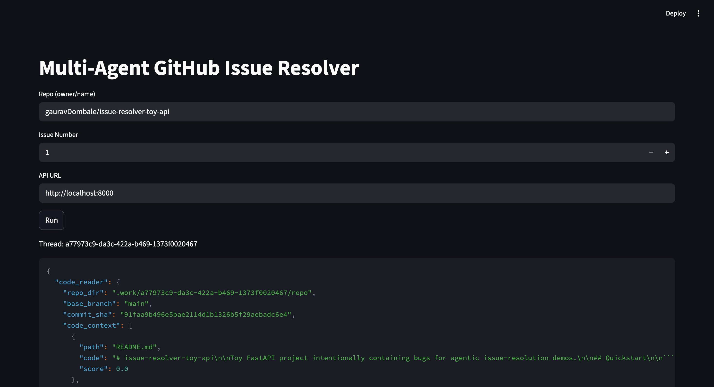
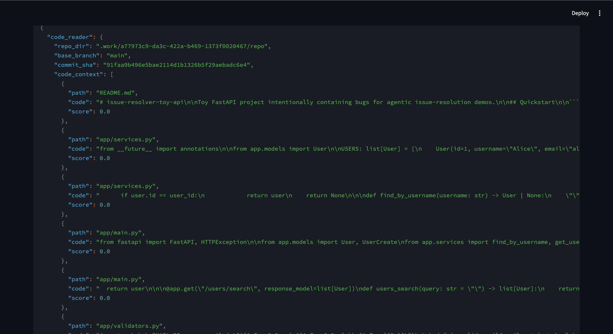
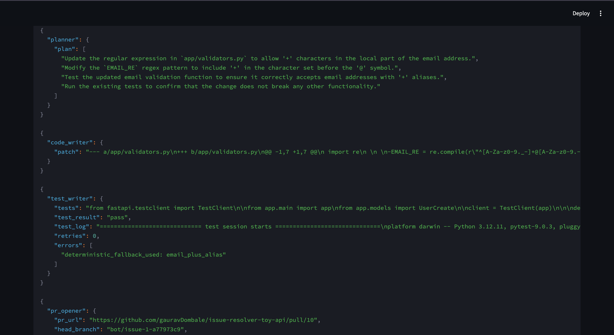
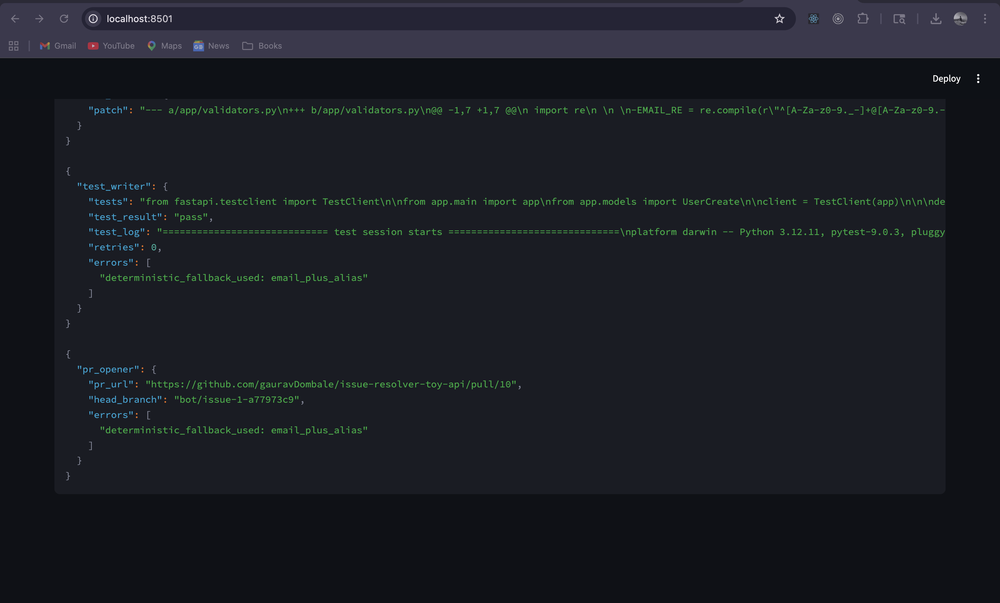
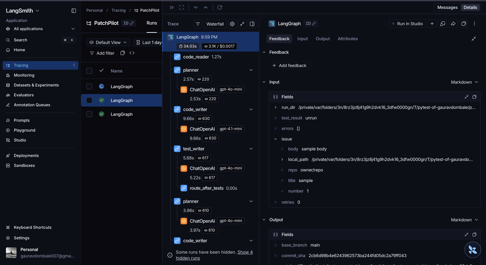

# PatchPilot

PatchPilot is a multi-agent GitHub issue resolver built with LangGraph. It reads a GitHub issue, retrieves relevant repository context, plans a fix, generates and applies a patch, writes regression tests, runs validation, and opens a pull request when the run passes.

## What it does

- Resolves GitHub issues through a stateful LangGraph workflow
- Retrieves code context from a local repo copy or remote clone
- Produces unified diffs and applies them in an isolated workspace
- Generates pytest regressions and gates PR creation on test success
- Streams live run events over FastAPI Server-Sent Events
- Exposes a Streamlit UI for demo and review
- Emits LangSmith traces for graph and model activity

## Demo

### Streamlit run overview



### Retrieved repository context in the live run



### Planner, patch, and test results



### Final PR output



### LangSmith trace



## Architecture

```text
GitHub Issue
   |
   v
LangGraph StateGraph
   |- code_reader   -> prepare workspace + retrieve code context
   |- planner       -> produce structured fix plan
   |- code_writer   -> generate/apply unified diff
   |- test_writer   -> generate regression tests + run pytest
   |- pr_opener     -> create branch, commit, push, and open PR

Routing:
  test_writer -> pr_opener if tests pass
  test_writer -> planner   if tests fail and retries < 2
  test_writer -> END       if retries >= 2
```

## Tech stack

- Python `3.12`
- LangGraph
- LangChain OpenAI
- FastAPI + Uvicorn
- Streamlit
- GitPython
- PyGithub
- LangSmith
- ChromaDB as an optional retrieval backend

## Repository structure

```text
multi-agent-issue-resolver/
├── src/resolver/
│   ├── agents/
│   ├── api/
│   ├── prompts/
│   ├── tools/
│   ├── ui/
│   ├── config.py
│   ├── graph.py
│   └── state.py
├── evals/
├── img/
├── tests/
├── Dockerfile
├── Makefile
└── pyproject.toml
```

## Setup

### Prerequisites

- Python `3.12`
- `uv`
- GitHub token with repo access for target repositories
- OpenAI API key
- LangSmith API key if you want traces and hosted eval uploads

### Install

Full local environment:

```bash
uv sync --extra dev --extra ui --extra vector
```

Lean API-only environment:

```bash
uv sync --extra dev
```

Notes:

- `ui` installs Streamlit for the demo interface
- `vector` installs ChromaDB and LangChain Community for vector retrieval
- without `vector`, retrieval falls back to local text matching

### Environment

Create `.env` from the example:

```bash
cp .env.example .env
```

Required values:

```env
OPENAI_API_KEY=sk-...
GITHUB_TOKEN=github_pat_...
LANGSMITH_API_KEY=lsv2_...
LANGSMITH_TRACING=true
LANGSMITH_ENDPOINT=https://api.smith.langchain.com
LANGSMITH_PROJECT=PatchPilot
DEFAULT_MODEL=gpt-4o-mini
CODER_MODEL=gpt-4.1-mini
EMBED_MODEL=text-embedding-3-small
CHROMA_DIR=./.chroma
WORK_DIR=./.work
```

## Running locally

### API

```bash
make run
```

Starts FastAPI at `http://localhost:8000`.

### UI

In a second terminal:

```bash
make ui
```

Opens the Streamlit UI at `http://localhost:8501`.

### Example resolve run

```bash
curl -N -X POST http://localhost:8000/resolve \
  -H "Content-Type: application/json" \
  -d '{
    "repo": "gauravDombale/issue-resolver-toy-api",
    "issue_number": 1,
    "local_path": "/Users/gauravdombale/PatchPilot/issue-resolver-toy-api"
  }'
```

### API endpoints

- `POST /resolve`
  - request body:
    - `repo`
    - `issue_number`
    - `local_path`
  - response:
    - SSE stream of graph node updates
  - headers:
    - `x-thread-id`
- `GET /runs/{thread_id}`
  - returns the persisted graph state snapshot

## Testing and quality checks

```bash
make test
make lint
make typecheck
```

Current local validation:

- `pytest`: passing
- `ruff`: passing
- `mypy`: passing

## Evals

Local eval:

```bash
make eval
```

LangSmith-backed eval upload:

```bash
make eval-upload
```

`make eval-upload` uploads dataset/examples to LangSmith. Use it only when that is acceptable for your repository data.

## Results

Measured project results:

- Successful end-to-end local issue resolution run for `gauravDombale/issue-resolver-toy-api` issue `#1`
- Real PRs opened against the toy repo during testing
- Local eval summary:

```json
{
  "mode": "local",
  "cases": 10,
  "tests_pass_rate": 1.0,
  "patch_similarity_avg": 0.198
}
```

## Observability

PatchPilot supports LangSmith tracing for:

- LangGraph node execution
- ChatOpenAI calls
- latency and token usage visibility
- run inspection through the LangSmith waterfall view

If traces do not appear:

- verify `LANGSMITH_PROJECT=PatchPilot`
- verify `LANGSMITH_TRACING=true`
- restart the API after changing `.env`
- trigger a new `/resolve` run after restart

## Docker

Build the production API image:

```bash
docker build -t patchpilotai-resolver .
```

Measured image size:

- `patchpilotai-resolver:latest` = `341MB`

This image is API-focused and excludes optional UI/vector dependencies from the base runtime image.

## Operational notes

- If `OPENAI_API_KEY` is missing, planner/writer/tester fall back to safe local behavior
- If `GITHUB_TOKEN` is missing or lacks push access, PR creation falls back to a mock PR URL
- Deterministic handlers are enabled for the known toy issues used by the eval suite
- Target repositories can be private if the token has the required permissions

## Roadmap

- Replace deprecated Chroma integration import path
- Tighten LangGraph model parameter warnings
- Expand eval dataset and scoring depth
- Add GIF/video demo asset for the full run flow
